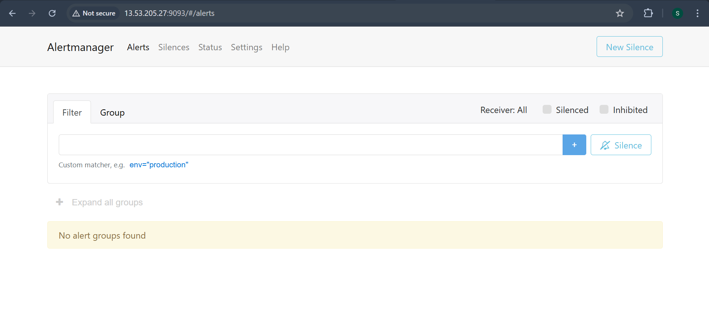
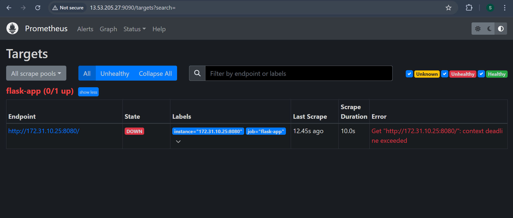
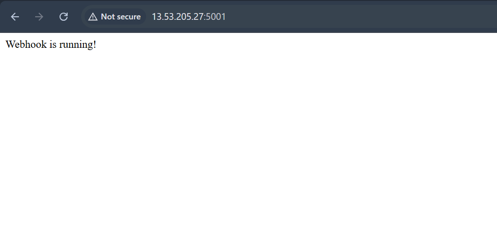
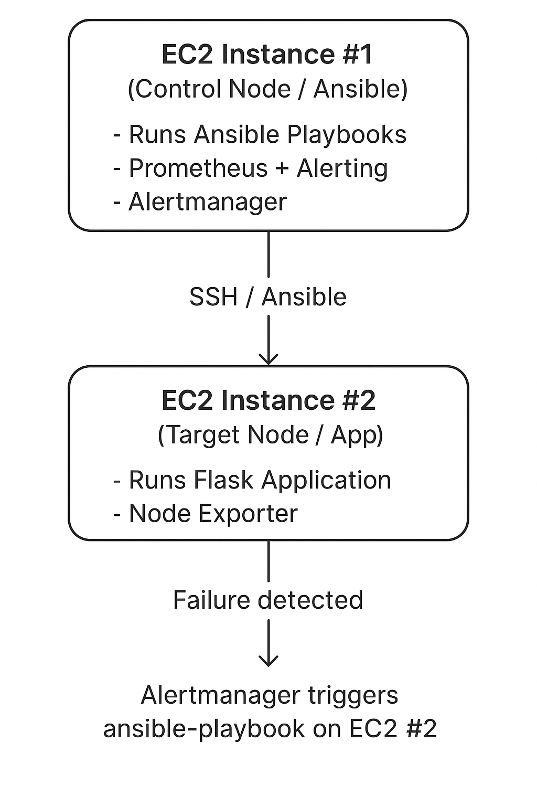

**Self-Healing Infrastructure Project**

Project Overview:

This project demonstrates a Self-Healing Infrastructure setup using:

* Ansible – to automate recovery of failed services

* Prometheus – to monitor metrics and trigger alerts

* Alertmanager – to manage and notify alerts

* Flask Webhook – receives alerts and triggers remediation scripts

The infrastructure is designed to detect failures automatically and restore services without manual intervention.

Architecture Diagram:

* Components:

  1. Prometheus – Monitors server and application metrics

  2. Alertmanager – Sends alerts to the webhook on failures

  3. Flask Webhook – Receives alerts and executes Ansible playbooks

  4. Ansible – Runs playbooks to self-heal the infrastructure

Setup Instructions:

1. Clone the repository:

       git clone [https://github.com/TomarShubhangi/self-healing-infra.git](https://github.com/TomarShubhangi/self-healing-infra.git)

       cd self-healing-infra

3. Install dependencies (Python & Ansible):

       sudo apt update
       sudo apt install python3-pip ansible -y
       pip3 install -r flask\_webhook/requirements.txt  # if using requirements

5. Configure Prometheus & Alertmanager: Update alertmanager/alertmanager.yml with your alerting rules.

6. Run Flask Webhook:

       cd flask\_webhook

       python3 webhook.py

7. Test Ansible Playbooks:

       ansible-playbook ansible/playbooks/self\_heal.yml -i ansible/hosts.ini

Screenshots:

* Prometheus Dashboard: (add images/prometheus\_dashboard.png)
* Alertmanager Alerts: (add images/alertmanager\_alerts.png)
* Webhook Logs: (add images/webhook\_logs.png)

Project Structure:

self-healing-infra/

├── alertmanager/           # Alertmanager config

├── ansible/                # Ansible hosts & playbooks

├── flask\_webhook/          # Webhook app to trigger remediation

├── README.md

├── .gitignore

└── images/                 # images for the dashboard

## Screenshots

Notes:

* Do not include venv/ or large binaries in GitHub; use .gitignore
* Images should be stored in the images/ folder and linked in README

License:
MIT License © 2025 Shubhangi Tomar

